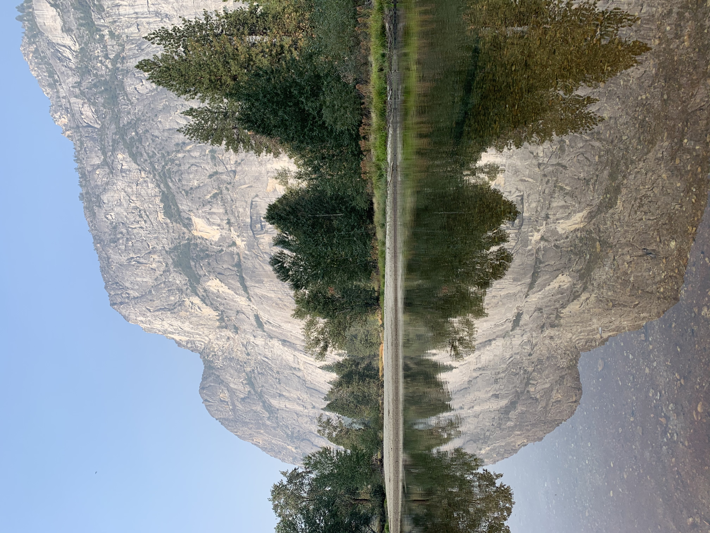

## Welcome to choiboi24's Nature Page

This page is dedicated to showing many different wonders of nature that I come across. All of the pictures here are mine, none of which are edited. If you wish to find places to go out and explore, the [NPS' website](https://www.nps.gov/) is a great place to start.

### Yosemite National Park

I was fortunate enough to visit Yosemite National Park, and I do not regret going there at all. The massive granite slabs known as mountains were jaw dropping, and the various bodies of crystal clear water were gorgeous. When I visited, however, the air was not the cleanest due to the California wildfires. Below is a picture that I took of one of the smaller mountains.

###Multnomah Falls

When I traveled with my cross country team to Oregon, we visited Multnomah Falls while we were there. The hike did not seem too bad at first, but it caught up to us since we were carrying our backpacks with us. Once we got to the top however, there was a pretty view of all the lush greenery around us. I'm glad that we went and visited this waterfall during our trip.

